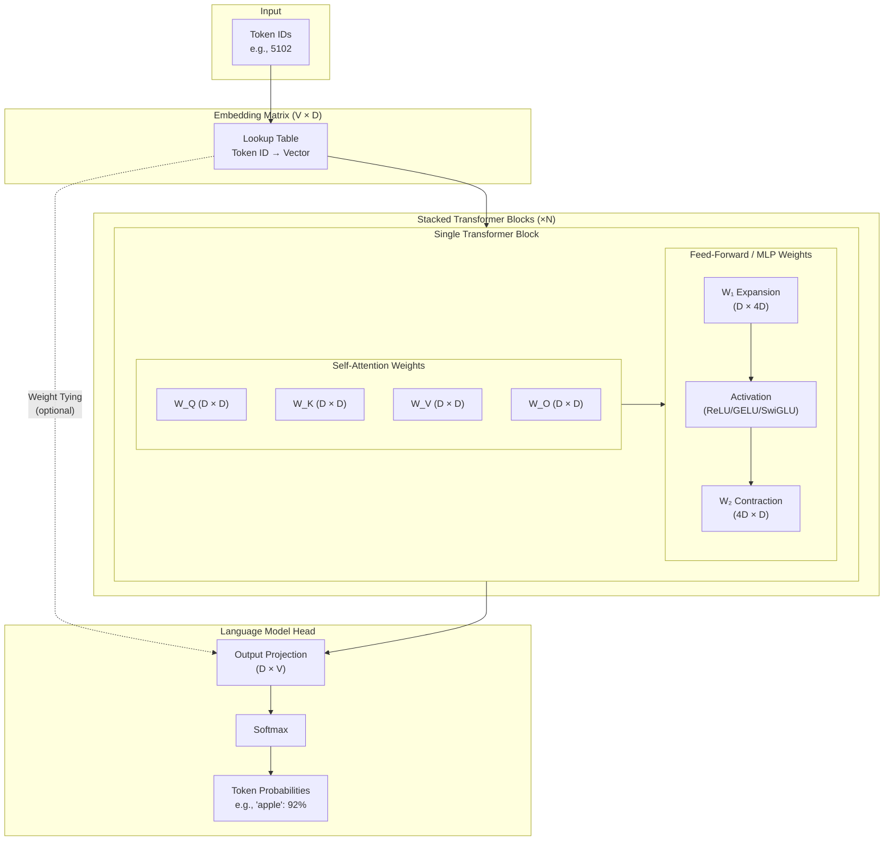

When we talk about the number of parameters a model has (e.g., 8 billion parameters), we're talking about the total number of trainable numbers in the model, including the embedding matrix, the stacked transformer blocks, and the language modeling head. At inference time, inputs are passed through these layers in sequence, with each layer passing its output to the next layer.

## Embedding Matrix

Assume we want to train an LLM, have collected a corpus of text to train on, and performed our train/test splits.

1. Our first step must be to **tokenize** the text in the corpus. There are a lot of ways to do this: you can tokenize by byte, tokenize by word, or (more commonly) have a model "learn" the optimal way to tokenize. But in the end, you should have decomposed your text corpus into a comprehensive set of non-colliding text fragments (often comprised of three or four letters or punctuation marks). These are your **tokens**. And you assign each token an integer ID (e.g., "apple" might become `5102`.)
2. The next step is to create the **embedding matrix** for the model: a giant lookup table (matrix of size `Vocabulary_Size x Model_Dimension`) that keys a vector of floats of length `Model_Dimension` to each token's integer ID (e.g., `{5102: [random.random() for i in [0:512]}` for our "apple" example). This is your initial embedding, representing the meaning of each token. We initialize it with random numbers.
3. As the model trains on your corpus, it uses **backpropagation** to "learn" the meanings of, and relationships between, words by adjusting these numbers.

Traditional models also had a positional embedding matrix of size `Max_Sequence_Length x Model_Dimension`, but newer models use a transformation function called RoPE in the `Q` and `K` attention layers instead.

## Stacked Transformer Blocks

A language model consists of `N` blocks, between 12 for GPT-2 and over 80 in big models. Each block contains two components:

- The **Self-Attention Weights**
    - A collection of four matrices of size  `Model_Dimension x Model_Dimension`: Query, Key, Value, and Output ($W_Q$, $W_K$, $W_V$, $W_O$).
    - Encodes relationships between tokens. Position is expressed by "rotating" the Q and K matrices for each token in proportion to its position in the sequence.
- The **Feed-Forward (Multi-Layer Perceptron, or MLP) Weights**
    - Two layers, expansion layer ($W_1$) and contraction layer ($W_2$)
    - They are transposed layers, typically of size `Model_Dimension x 4*Model_Dimension` (e.g., `512 x 2048`) and `4*Model_Dimension x Model_Dimension` (e.g., `2048 x 512`)
    - These layers encode factual knowledge and can learn more complex, non-linear features than the attention layer can. (The weights of each matrix are technically linear, but something called an "activation function," such as ReLU, GELU, or SwiGLU, "projects" the data to a higher dimension and captures non-linear boundaries.)

Like the embedding layer, these weights are all initialized with random numbers.

## Language Model Head

The final layer is a matrix of size `Model_Dimension x Vocabulary_Size` that produces "logits"—raw probability scores for every single token in the dictionary. A Softmax function is then applied to turn these scores into percentages (e.g., "apple" has a 92% probability of being next). The highest number is the best guess for the next token.

In many models, the embedding matrix is shared with the final output layer to save memory. In those cases, the `V x D` matrix at the start and the `D x V` matrix at the end are actually the same physical data. This saves billions of parameters.

